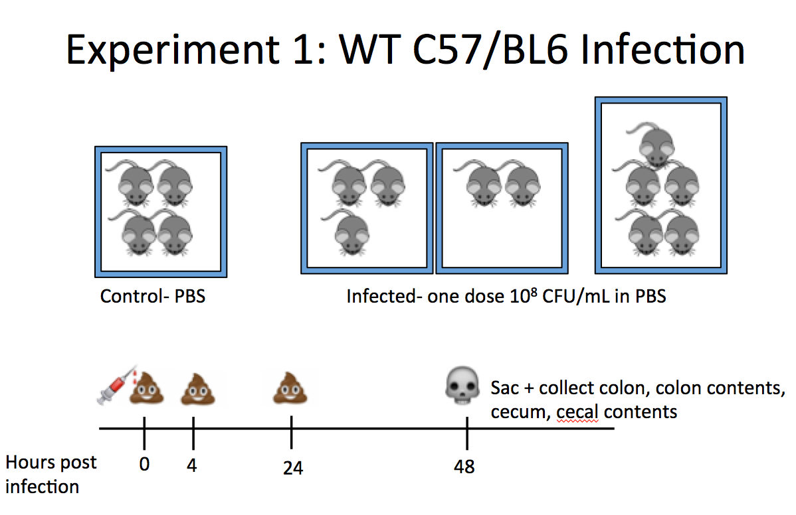
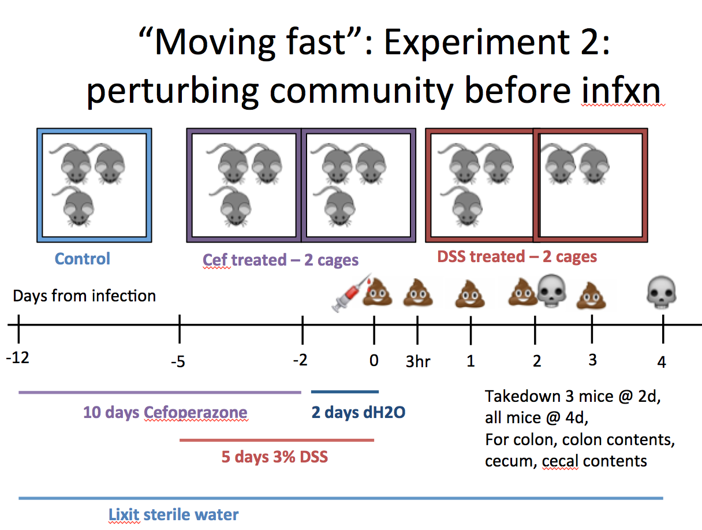

##Summary
This report details the experimental design and results from 16S rRNA analysis of two mouse infection experiments. The goal of the study was to determine if Fusobacterium was detectable in stool and if it could colonize a conventional, antibiotic treated or DSS-treated mouse. This was a good first step and ultimately very informative to the design of our next experiments. 

##Experimental Design

###Experiment 1

####Experimental design
This was my first attempt at infecting mice with Fusobacterium. I grew the bacteria up for 2 days anaerobically in supplemented BHI and then infected at ~10^8 CFU/mL. Control mice got PBS gavage. Matt Jenior was around to help with the set up and gavaging step. I plated my input for CFU and enumerated that 5 days later. 1 cage of mice was uninfected, 3 other cages were infected. Mice were of both genders and around 8-10 weeks old. 

I collected stool at 0, 3, 24 and 48hrs. At 48hr I did a takedown and cecum and colon necropsy. 



####Results
The results from the experiment are as shown below. Interestingly, there are several species of Fusobacterium that come up when running 16S. I was able to identify the Fuso input species and only have plotted that OTU (Otu00110) abundance below. 

```{r, echo=FALSE}
fuso_nmds <- read.table("fuso_mouse.final.tx.unique_list.thetayc.1.lt.ave.nmds.axes", header = T)

fuso_nmds<-fuso_nmds[grep("[0-9]+-8.+", fuso_nmds$group, invert=T),]

metadata <- read.delim("metadata.tsv", sep = "\t", header = T)

full_data <- merge(fuso_nmds, metadata, by.x = 'group', by.y='sampleID')

subsampled <- read.table("fuso_mouse.final.an.unique_list.0.03.subsample.shared", header = T)

fusoOTUs <- merge(full_data, subsampled)

taxonomy_file <- read.table(file="fuso_mouse.final.an.unique_list.0.03.cons.taxonomy", header =T, row.names = 1)

subsampled <- subsampled[,!(colnames(subsampled) %in% c("label", "numOtus"))]

fusoOTUs <- merge(metadata, subsampled)

only_fuso <- subsampled[, (colnames(subsampled) %in% c("Group", "Otu00110", "Otu00243", "Otu00313", "Otu00961", "Otu00994", "Otu01880"))]
only_fuso[,7] <- only_fuso[,2] + only_fuso[,3] + only_fuso[,4] + only_fuso[,5] + only_fuso[,6]

names(only_fuso)[7] <- "fuso_total"
fuso_avg <- only_fuso[, colnames(only_fuso) %in% c("Group", "fuso_total")]

fuso_abund <- merge(fuso_avg, metadata, by.x='Group', by.y='sampleID')

#load the metadata in separately by experiment 
expt1metadata <- read.delim("expt1_metadata.tsv", sep = "\t", header = T)
expt2metadata <- read.delim("expt2_metadata.tsv", sep = "\t", header = T)
names(expt2metadata)<- c("sampleID", "mouse", "cage", "day", "location", "experiment", "infected")

fuso_abund1 <- merge(fuso_avg, expt1metadata, by.x="Group", by.y="sampleID")
fuso_abund2 <- merge(fuso_avg, expt2metadata, by.x="Group", by.y="sampleID")

fuso_110 <- only_fuso[, colnames(only_fuso) %in% c("Group", "Otu00110")]
fuso_110_1 <- merge(fuso_110, metadata, by.x='Group', by.y='sampleID')

#expt 1 stuff
fuso_110_abund <- merge(fuso_110, expt1metadata, by.x="Group", by.y="sampleID")

#expt 2 stuff 
fuso_110_abund2 <- merge(fuso_110, expt2metadata, by.x = "Group", by.y = "sampleID")

#expt 1 table
fuso_110_abund[,10] <- (fuso_110_abund[,2]/12)
names(fuso_110_abund)[10] <- "Otu00110_relAbund"

#xpt 2
fuso_110_abund2[,10] <- (fuso_110_abund2[,2]/12)
names(fuso_110_abund2)[10] <- "Otu00110_relAbund"

names(fuso_110_abund2)[9] <- "treatment"
```

This is a plot of all of the samples and whether they were infected or not. It looks like one or some of the uninfected samples had fusobacterium in them. Contamination? 

```{r, echo = FALSE}
#expt 1 graphs
#fuso abundance in all samples, infected vs not.
stripchart(fuso_110_abund$Otu00110_relAbund~fuso_110_abund$infected, vertical = 'TRUE', method = 'jitter', main = "fusobacterium OTU00110 abundance, expt 1", xlab = "infected?", ylab = "n OTU00110 fuso abundance")
```


Breaking down the results a little more, we can examine the abundance of this fuso species by location. It appears it prefers the colon and cecal tissue over stool. This also explains why I was having trouble culturing fuso from stool and also in my qPCR experiments. 

```{r, echo = FALSE}
#by location
stripchart(fuso_110_abund$Otu00110_relAbund~fuso_110_abund$location, vertical = 'TRUE', method = 'jitter', main = "Fusobacterium abundance, expt 1", xlab = "location", ylab = "%Fuso abundance")
```

Looking at the abundance by mouse, we can see both that the abundance varies between mice and between cages. 

```{r, echo = FALSE}
#by mouse
stripchart(fuso_110_abund$Otu00110_relAbund~fuso_110_abund$mouse, vertical = 'TRUE', method = 'jitter', main = "Fusobacterium abundance by mouse, expt 1", xlab = "mouse #", ylab = "%Fuso abundance")
```


```{r, echo = FALSE}
#by cage
stripchart(fuso_110_abund$Otu00110_relAbund~fuso_110_abund$cage, vertical = 'TRUE', method = 'jitter', main = "Fusobacterium abundance by cage, expt 1", xlab = "cage", ylab = "%Fuso abundance")
```

Looking at the distribution of abundance by timepoint, the fuso abundance is higher at 48hr, consistent with the finding that it is most commonly found in tissue samples (and the only tissue samples were taken at 48h). 

```{r, echo = FALSE}
#by time
stripchart(fuso_110_abund$Otu00110_relAbund~fuso_110_abund$day, vertical = 'TRUE', method = 'jitter', main = "Fusobacterium abundance by timepoint, expt 1", xlab = "day", ylab = "n OTU00110 fuso abundance")
```

####Conclusions 
This experiment was informative because it showed that stool is not going to be a great readout for fuso abundance. The fact that some of the uninfected mouse cage got infected is perplexing and I think we should use at least two uninfected control cages in the future. 

###Experiment 2

####Experimental Design 
The goal of this experiment was to test if pre-treatment of Cefeparazone or DSS created conditions that positively supported the colonization of the gut by Fusobacterium. I grew the bacteria from frozen as described in Experiment 1. I infected using the outline as described below. One thing of note was that the amount of fuso that was enumerated after input was 5-10fold lower than the first experiment, which may have affected the outcome of the experiment. 



####Results 

This plot shows all of the samples and their Fuso abundance whether they were infected or not. Similar to experiment 1, there are some uninfected controls that came up Fusobacterium positive. Additionally, the abundance is overall about 10-fold lower in this experiment. Consistent with the previous experiment, the fusobacterium is found more commonly in tissue than in stool samples, though again we are limited by the lower abundance overall. 

```{r, echo = FALSE}
#expt2 graphs 
#by infected or not
stripchart(fuso_110_abund2$Otu00110_relAbund~fuso_110_abund2$infected, vertical = 'TRUE', method = 'jitter', main = "fusobacterium abundance, expt 2", xlab = "infected?", ylab = "n OTU00110 fuso abundance")
```

```{r, echo = FALSE}
#by location
stripchart(fuso_110_abund2$Otu00110_relAbund~fuso_110_abund2$location, vertical = 'TRUE', method = 'jitter', main = "fusobacterium OTU00110 abundance, expt 2", xlab = "location", ylab = "n OTU00110 fuso abundance")
```

In these results we can see really only a few mouse got infected, if at all. This low and inconsistent level of infection confounds most further analysis. 

```{r, echo = FALSE}
#by mouse
stripchart(fuso_110_abund2$Otu00110_relAbund~fuso_110_abund2$mouse, vertical = 'TRUE', method = 'jitter', main = "fusobacterium OTU00110 abundance, expt 2", xlab = "mouse", ylab = "n OTU00110 fuso abundance")
```

Same by day, the amount of fuso trends with the timepoints that necropsy samples were taken. 

```{r, echo = FALSE}
#by time
stripchart(fuso_110_abund2$Otu00110_relAbund~fuso_110_abund2$day, vertical = 'TRUE', method = 'jitter', col = c("red", "orange", "yellow", "green", "blue", "purple"), main = "n samples with fusobacterium OTU00110 present, expt 1", xlab = "day", ylab = "n OTU00110 fuso abundance")
```

Finally, the most interesting part of the experiment was to see if pre-treatment affected fuso colonization. Again, becasue of the low level and inconsistent amount of infection it's hard to draw conclusions but these results show that antibiotic treated mice were more easily colonized than the other mice in this experiment. 

```{r, echo = FALSE}
#by category
stripchart(fuso_110_abund2$Otu00110_relAbund~fuso_110_abund2$treatment, vertical = 'TRUE', method = 'jitter', col = c("green", "blue", "purple"), main = "n samples with fusobacterium OTU00110 present, expt 2", xlab = "treatment", ylab = "n OTU00110 fuso abundance")
```

###Conclusions
I'm frustrated we didn't have a better infection level in this experiment, we really could have gotten a lot more information out of it. I think these conditions are worth testing again, either as part of a smaller or larger experiment. Additionally, the variability in innoculum is frustrating too. I think that while these results are inconclusive overall they do show that fusobacterium can infect mice and be detected within a community, primarily in tissue and not stool samples. These results will help inform future experiments and the design of a high-throughput screen to test this model. 
